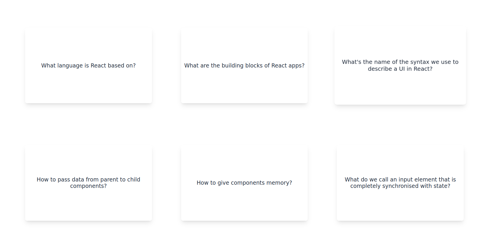

# React Flashcards Quiz

An interactive flashcard application built with React that helps users learn React concepts through a question-and-answer format. This project was created as part of a React learning journey from a Udemy course.

 

## Features

- Interactive flashcards with questions about React fundamentals
- Grid-based layout for easy navigation
- Click-to-reveal answers
- Modern and responsive design with Tailwind CSS
- Smooth animations and transitions
- Memory state management using React hooks

## Technologies Used

- React 19.0.0
- Vite 6.3.1
- Tailwind CSS 4.1.4
- JavaScript (ES6+)

## Getting Started

### Prerequisites

- Node.js (Latest LTS version recommended)
- npm or yarn package manager

### Installation

1. Clone the repository:
```bash
git clone [https://github.com/Briso10-dev/React-challenge3-flashcards.git]
```

2. Navigate to the project directory:
```bash
cd React-challenge3-flashcards
```

3. Install dependencies:
```bash
npm install
```

4. Start the development server:
```bash
npm start
```

5. Open your browser and visit `http://localhost:5173`

## Usage

- Click on any card to reveal its answer
- Click again to hide the answer
- Cards are color-coded:
  - Gray: Question is displayed
  - Red: Answer is revealed

## Learning Objectives

This project demonstrates understanding of:
- React Components
- State Management with useState
- Event Handling
- Conditional Rendering
- CSS Grid Layout
- Modern React Development with Vite

## Development

To modify or extend this project:

1. The main component is in `src/components/flash-cards.jsx`
2. Styles are managed through Tailwind CSS classes
3. Questions can be modified in the `questions` array within the main component

## License

This project is open-source and available under the MIT License.

## Acknowledgments

- Built with modern React best practices
- Styled with Tailwind CSS


**Happy Coding!** 🚀

---
